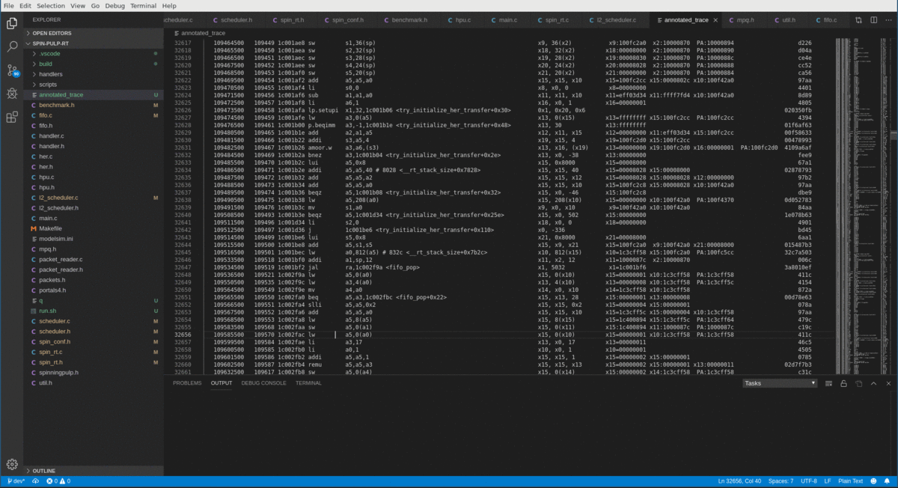

# trace2source README

VSCode extension that allows to examine the trace of a RI5CY core. The trace must be annotated with the "annotate_trace" tool (this
can be changed by changing the trace regex). 

## Features

 - Open the folder with the PULP project (e.g., spin-pulp-rt) from which the trace has been generated.
 - Open the annotated trace (keep the focus on the editor with the trace)
 - CTRL-SHIFT-P and launch the "Examine trace" command. 
 - Select the PULP executable that generated the trace. 
 - The extension will start processing the trace. This can take some time depending on how long is the trace.
 - A message appears when the trace has been processed.
 - Now you can click on any line of the trace. If that instruction can be translated to a source file
   in the open workspace, then a new column will appear and the source line will be highlighted. Moreover,
   in the trace editor all the instructions generated by the same source file will be highlighted. 
 - The test/ folder contains

## Requirements

 - addr2line 

## Extension Settings

Not at the moment.

## Install

 - code --install-extension <package>.vsix 
 - Check out the release page for the package

## Known Issues

## Release Notes

 - First release.

-----------------------------------------------------------------------------------------------------------

